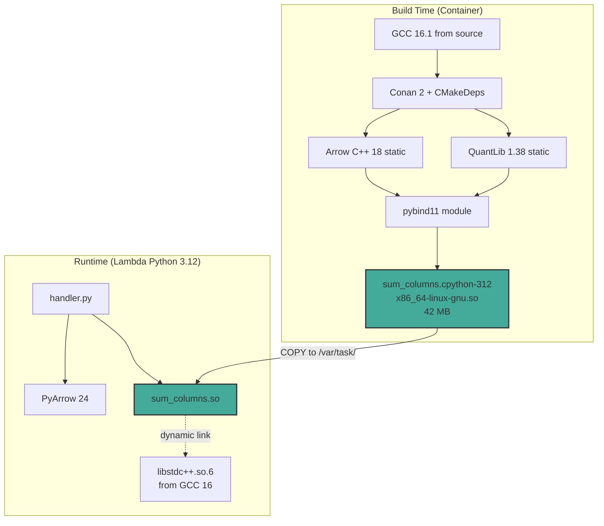
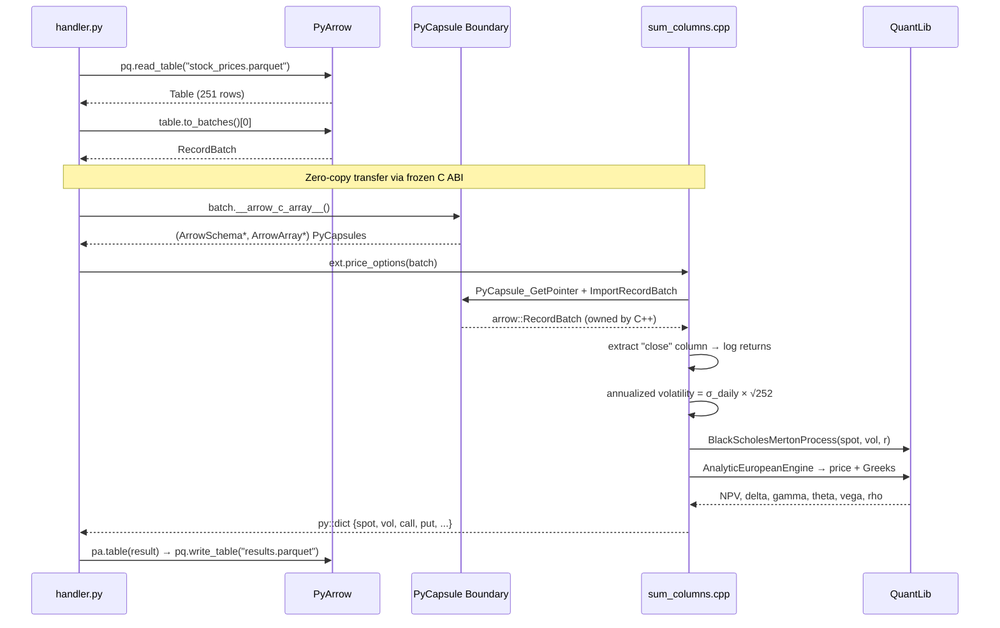
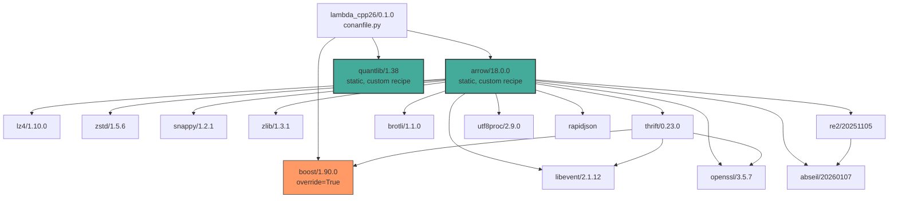
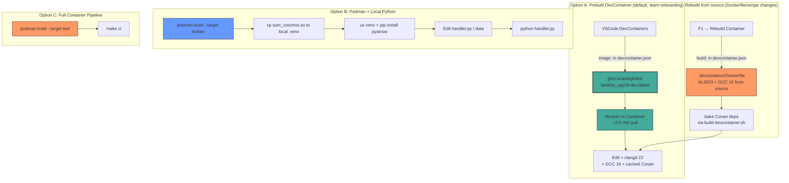
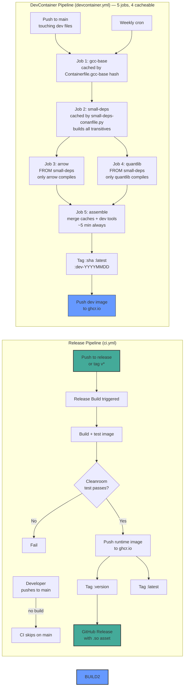

# Architecture

## System Overview



## Data Flow: Parquet → C++ → Parquet



## Build Pipeline

```mermaid
graph LR
    subgraph "Containerfile Stage 1: Builder"
        BASE[FROM lambda/python:3.12]
        DNF[dnf install deps<br/>+ perl-FindBin + diffutils]
        GCC[Build GCC 16.1<br/>~10 min, cached]
        PIP[pip install conan<br/>cmake ninja pybind11]
        EXPORT[conan export<br/>arrow + quantlib recipes]
        INSTALL[conan install<br/>--build=missing<br/>--mount=type=cache]
        BUILD[conan build<br/>→ .so]
        STRIP[strip --strip-unneeded<br/>for production deploy]
        
        BASE --> DNF --> GCC --> PIP --> EXPORT --> INSTALL --> BUILD --> STRIP
    end
    
    subgraph "Containerfile Stage 2: Test"
        TESTBASE[FROM lambda/python:3.12]
        PYA[pip install pyarrow]
        COPY1[COPY .so + libstdc++]
        COPY2[COPY handler.py + data/]
        ASSERT1[RUN: import sum_columns]
        ASSERT2[RUN: price_options test]
        ASSERT3[RUN: ldd audit]
        
        TESTBASE --> PYA --> COPY1 --> COPY2 --> ASSERT1 --> ASSERT2 --> ASSERT3
    end
    
    STRIP -->|.so| COPY1
    
    style GCC fill:#f96,stroke:#333,stroke-width:2px
    style INSTALL fill:#69f,stroke:#333,stroke-width:2px
    style BUILD fill:#4a9,stroke:#333,stroke-width:2px
```



### Dev vs Production Build Flags

The `sum_columns.so` is built with **different flag sets** depending on
context:

| Flag | Local dev (build/Release/) | Production (Containerfile) |
|------|----------------------------|----------------------------|
| `-O3` | ✅ (preserved from Conan Release profile) | ✅ |
| `-g` (compile) | ✅ (added via `target_compile_options`) | ✅ |
| `-g` (link) | ✅ (added via `target_link_options`) | ✅ |
| `-flto=auto` | ✅ (Conan toolchain) | ✅ |
| `pybind11_strip` | ❌ disabled (no-op override) | n/a — Containerfile strips |
| `strip --strip-unneeded` | ❌ skipped | ✅ explicit step |
| Resulting `.so` size | ~60 MB (DWARF included) | ~42 MB (stripped) |

**Why two paths**: local dev needs DWARF debug info for LLDB breakpoints to
hit when pytest calls into the module. Production Lambda strips DWARF for
cold-start size. `src/CMakeLists.txt` comments document all three
compounding fixes required for this split to work (missing `-g` compile,
missing `-g` link with LTO, pybind11 3.0 auto-strip override) — see
[`docs/developer-guide.md`](./developer-guide.md) §"Debugging sum_columns.cpp"
for the full case study.

## Conan Dependency Graph



## Capsule Boundary (Zero-Copy)

```mermaid
graph LR
    subgraph "Python / PyArrow"
        PYT[pyarrow.RecordBatch]
        PYA_LIB[PyArrow's libarrow.so]
        CAP_GEN[__arrow_c_array__]
    end
    
    subgraph "Frozen C ABI (no symbols cross)"
        SCHEMA[ArrowSchema*<br/>format, name, release()]
        ARRAY[ArrowArray*<br/>length, buffers, release()]
    end
    
    subgraph "C++ / Our libarrow.a"
        IMPORT[arrow::ImportRecordBatch]
        OUR_LIB[Our static libarrow.a]
        COMPUTE[sum / QuantLib pricing]
    end
    
    PYT --> CAP_GEN
    CAP_GEN --> SCHEMA
    CAP_GEN --> ARRAY
    SCHEMA -->|PyCapsule_GetPointer| IMPORT
    ARRAY -->|PyCapsule_GetPointer| IMPORT
    IMPORT --> OUR_LIB
    OUR_LIB --> COMPUTE
    
    style SCHEMA fill:#ff9,stroke:#333,stroke-width:2px
    style ARRAY fill:#ff9,stroke:#333,stroke-width:2px
```

## Development Environments



**Prebuilt image contents**: GCC 16.1.0, clangd 22.1.1 (via pip, supports C++26),
Conan dep cache (~37 packages: arrow, quantlib, boost, …), pybind11, CMake 4.3,
system packages from `clang-tools-extra`/`gdb`/`valgrind`.  Bind-mounted
workspace stays out of the image — teammates get a fresh source checkout
while inheriting the toolchain and dep cache.

## DevContainer Image Publishing

```mermaid
graph TB
    subgraph "Triggers"
        PUSH[Push to main<br/>touching .devcontainer/, recipes/,<br/>profiles/, src/, conanfile.py,<br/>Containerfile.*, *-conanfile.py]
        CRON[Weekly cron<br/>Sun 03:00 UTC]
        MANUAL[workflow_dispatch]
    end
    
    subgraph "Job 1: gcc-base (cacheable)"
        GH[Hash of<br/>Containerfile.gcc-base]
        GPULL[podman pull<br/>gcc-base:HASH]
        GSKIP{Hit?}
        GBUILD[podman build Containerfile.gcc-base<br/>GCC 16 from source<br/>~25 min cold]
        
        GH --> GPULL --> GSKIP
        GSKIP -->|hit| GDONE[cached]
        GSKIP -->|miss| GBUILD --> GDONE
    end
    
    subgraph "Job 2: small-deps (cacheable)"
        SH[Hash of small-deps-conanfile.py<br/>+ profile + gcc-base tag]
        SPULL[podman pull<br/>small-deps:HASH]
        SSKIP{Hit?}
        SBUILD[podman build Containerfile.small-deps<br/>FROM gcc-base<br/>conan install small-deps-conanfile.py<br/>boost + lz4 + zstd + thrift + openssl + ...<br/>~30-35 min cold on CI]
        
        SH --> SPULL --> SSKIP
        SSKIP -->|hit| SDONE[cached]
        SSKIP -->|miss| SBUILD --> SDONE
    end
    
    subgraph "Job 3: arrow (parallel, cacheable)"
        AH[Hash of recipes/arrow/*<br/>+ arrow-conanfile.py<br/>+ profile + small-deps tag]
        APULL[podman pull<br/>arrow:HASH]
        ASKIP{Hit?}
        ABUILD[podman build Containerfile.arrow<br/>FROM small-deps<br/>conan install arrow-conanfile.py<br/>only arrow compiles<br/>~25-30 min cold]
        
        AH --> APULL --> ASKIP
        ASKIP -->|hit| ADONE[cached]
        ASKIP -->|miss| ABUILD --> ADONE
    end
    
    subgraph "Job 4: quantlib (parallel, cacheable)"
        QH[Hash of recipes/quantlib/*<br/>+ quantlib-conanfile.py<br/>+ profile + small-deps tag]
        QPULL[podman pull<br/>quantlib:HASH]
        QSKIP{Hit?}
        QBUILD[podman build Containerfile.quantlib<br/>FROM small-deps<br/>conan install quantlib-conanfile.py<br/>only quantlib compiles<br/>~30 min cold]
        
        QH --> QPULL --> QSKIP
        QSKIP -->|hit| QDONE[cached]
        QSKIP -->|miss| QBUILD --> QDONE
    end
    
    subgraph "Job 5: assemble-devcontainer (always rebuilds)"
        AMULTI[multi-stage FROM arrow-cache<br/>+ quantlib-cache + small-deps]
        AMERGE[--mount=type=bind cp -rn merge<br/>~4 GB delta layer]
        ATOOLS[dnf install gdb valgrind<br/>pip install pyarrow pytest clangd]
        ACHECK[conan list arrow/* + quantlib/*<br/>sanity check]
        ATAGS[Tag :sha :latest :dev-YYYYMMDD]
        APUSH[podman push x3]
        
        AMULTI --> AMERGE --> ATOOLS --> ACHECK --> ATAGS --> APUSH
    end
    
    PUSH --> GH
    CRON --> GH
    MANUAL --> GH
    
    GDONE --> SH
    SDONE --> AH
    SDONE --> QH
    ADONE --> AMULTI
    QDONE --> AMULTI
    
    style GBUILD fill:#f96,stroke:#333,stroke-width:2px
    style SBUILD fill:#f96,stroke:#333,stroke-width:2px
    style ABUILD fill:#f96,stroke:#333,stroke-width:2px
    style QBUILD fill:#f96,stroke:#333,stroke-width:2px
    style AMULTI fill:#4a9,stroke:#333,stroke-width:2px
    style APUSH fill:#4a9,stroke:#333
```



**Why five jobs with `small-deps` as common ancestor** (the design that
finally worked after three failed parallel attempts):

Arrow and QuantLib both `FROM small-deps`, so their conan caches share
**IDENTICAL transitives**. When the assemble stage merges them via
`cp -rn` (no-clobber), only the deltas (arrow's binary, quantlib's binary)
get copied — no conflicts possible because the common parent guarantees
identical transitive package_ids.

| Scenario | Wall time |
|---|---|
| All cache hit | ~5 min (just assemble) |
| Dev-only tooling change (gdb, clangd version bump) | ~5 min (just assemble) |
| GCC base cache hit, small-deps miss, arrow+quantlib miss | ~60 min (small-deps 30 + parallel[arrow 25 ‖ quantlib 30] + assemble 5) |
| Full cold cache | ~85 min (gcc 25 + small-deps 30 + parallel[arrow 25 ‖ quantlib 30] + assemble 5) |
| Single recipe change (e.g. arrow only) | ~35 min (arrow 30 + assemble 5; quantlib + small-deps + gcc stay cached) |

**Cache keys** (content hashes on ghcr.io image tags, each suffixed with parent tag for cascade):
- `gcc-base:<hash of Containerfile.gcc-base>`
- `small-deps:<hash of small-deps-conanfile.py + profiles/al2023>–<gcc-base tag>`
- `arrow:<hash of recipes/arrow/* + arrow-conanfile.py + profiles/al2023>–<small-deps tag>`
- `quantlib:<hash of recipes/quantlib/* + quantlib-conanfile.py + profiles/al2023>–<small-deps tag>`

Including the parent tag in each child's hash ensures cascading rebuilds
(gcc-base change → small-deps rebuild → arrow + quantlib rebuild → assemble).

**Per-library conanfiles** (`arrow-conanfile.py`, `quantlib-conanfile.py`)
are critical: they apply the project's consumer-side options (`arrow`'s
`csv=False`/`json=False` overrides, `boost/1.90.0` with `override=True`)
so each parallel job produces the same binary variant the project's main
`conanfile.py` would. Without these, Conan 2's CLI `--requires=` skips
consumer options and produces a different variant that triggers a full
rebuild at consume time.

**Why not GitHub Packages as a Conan remote**: GitHub Packages (npm/nuget/maven/OCI)
does not implement Conan's REST API v2. Only GitLab has native Conan 2
registry support among forge platforms. The container-image-based caching
above achieves the same effect (cache binaries, reuse across CI runs, allow
local `podman pull`) without external infrastructure.

**Local pull** of intermediate images for custom builds:
```bash
podman pull ghcr.io/arekglinka/lambda_cpp26-gcc-base:latest    # GCC 16 base only
podman pull ghcr.io/arekglinka/lambda_cpp26-small-deps:latest  # + boost, lz4, openssl, thrift, abseil, ...
podman pull ghcr.io/arekglinka/lambda_cpp26-arrow:latest       # + Arrow 18.0.0 binary
podman pull ghcr.io/arekglinka/lambda_cpp26-quantlib:latest    # + QuantLib 1.38 binary
podman pull ghcr.io/arekglinka/lambda_cpp26-dev:latest         # full assembled devcontainer
```

**Local (fast) push** for sharing a known-good container state:
`scripts/push-devcontainer.sh` still works — commits the currently running
devcontainer and pushes to ghcr.io. Useful for hot-fix shares.

**Auth note**: CI uses `GITHUB_TOKEN` (auto-scoped with `packages:write`).
Local pushes need `gh auth refresh --scopes write:packages,read:packages`
(interactive browser flow). Packages created by local PAT pushes are
"owned" by the user account; subsequent GITHUB_TOKEN pushes from the repo
workflow will get HTTP 403 unless the user grants the repo write access
via Package Settings → Manage Actions Access. Cleanest fix: delete the
package and let CI recreate it owned by GITHUB_TOKEN.

**Tarball alternative**: `scripts/save-devcontainer-tarball.sh` exports to
`.tar.gz + .sha256` for airgapped / shared-drive distribution.

**Deprecated**: `scripts/build-devcontainer.sh` was the single-job build
script replaced by the workflow. Kept for historical reference.

## CI/CD Pipelines


