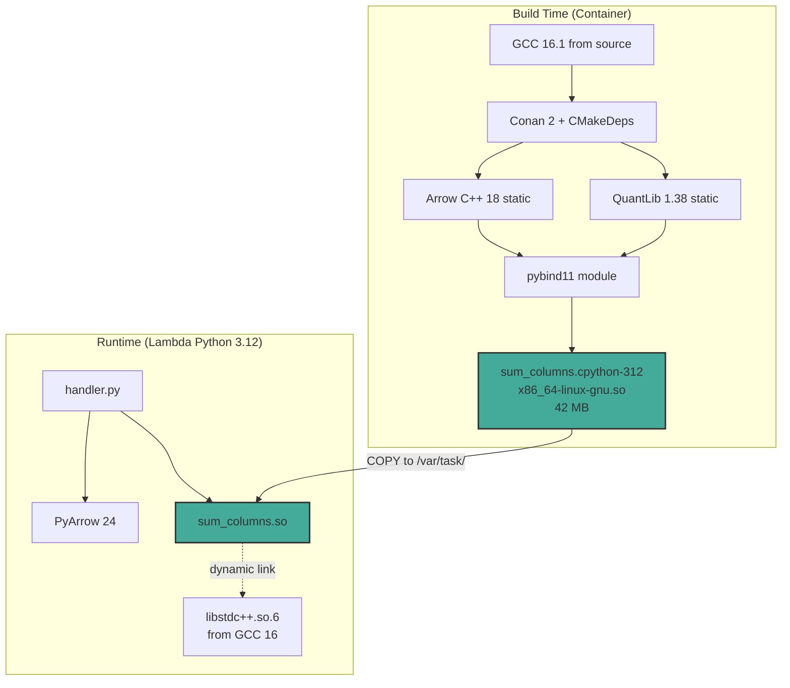
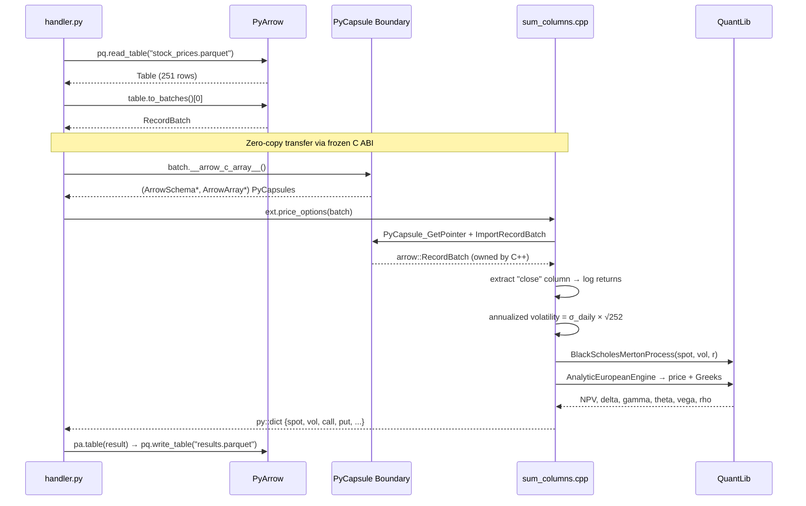
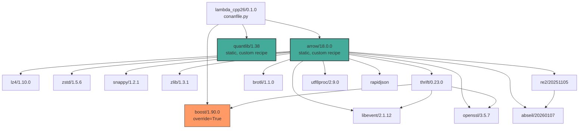
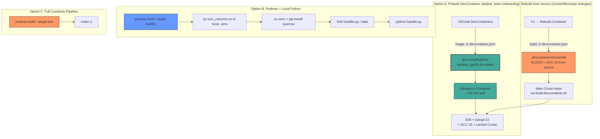
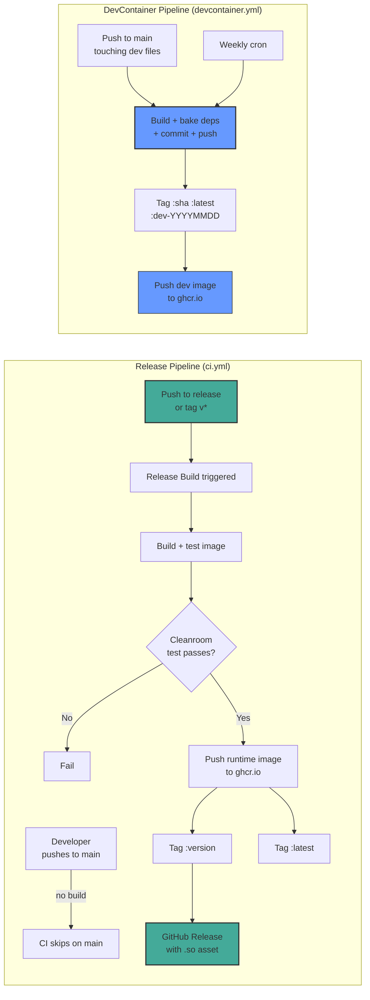

# Architecture

## System Overview



## Data Flow: Parquet → C++ → Parquet



## Build Pipeline

```mermaid
graph LR
    subgraph "Containerfile Stage 1: Builder"
        BASE[FROM lambda/python:3.12]
        DNF[dnf install deps<br/>+ perl-FindBin + diffutils]
        GCC[Build GCC 16.1<br/>~10 min, cached]
        PIP[pip install conan<br/>cmake ninja pybind11]
        EXPORT[conan export<br/>arrow + quantlib recipes]
        INSTALL[conan install<br/>--build=missing<br/>--mount=type=cache]
        BUILD[conan build<br/>→ .so]
        STRIP[strip --strip-unneeded]
        
        BASE --> DNF --> GCC --> PIP --> EXPORT --> INSTALL --> BUILD --> STRIP
    end
    
    subgraph "Containerfile Stage 2: Test"
        TESTBASE[FROM lambda/python:3.12]
        PYA[pip install pyarrow]
        COPY1[COPY .so + libstdc++]
        COPY2[COPY handler.py + data/]
        ASSERT1[RUN: import sum_columns]
        ASSERT2[RUN: price_options test]
        ASSERT3[RUN: ldd audit]
        
        TESTBASE --> PYA --> COPY1 --> COPY2 --> ASSERT1 --> ASSERT2 --> ASSERT3
    end
    
    STRIP -->|.so| COPY1
    
    style GCC fill:#f96,stroke:#333,stroke-width:2px
    style INSTALL fill:#69f,stroke:#333,stroke-width:2px
    style BUILD fill:#4a9,stroke:#333,stroke-width:2px
```



## Conan Dependency Graph



## Capsule Boundary (Zero-Copy)

```mermaid
graph LR
    subgraph "Python / PyArrow"
        PYT[pyarrow.RecordBatch]
        PYA_LIB[PyArrow's libarrow.so]
        CAP_GEN[__arrow_c_array__]
    end
    
    subgraph "Frozen C ABI (no symbols cross)"
        SCHEMA[ArrowSchema*<br/>format, name, release()]
        ARRAY[ArrowArray*<br/>length, buffers, release()]
    end
    
    subgraph "C++ / Our libarrow.a"
        IMPORT[arrow::ImportRecordBatch]
        OUR_LIB[Our static libarrow.a]
        COMPUTE[sum / QuantLib pricing]
    end
    
    PYT --> CAP_GEN
    CAP_GEN --> SCHEMA
    CAP_GEN --> ARRAY
    SCHEMA -->|PyCapsule_GetPointer| IMPORT
    ARRAY -->|PyCapsule_GetPointer| IMPORT
    IMPORT --> OUR_LIB
    OUR_LIB --> COMPUTE
    
    style SCHEMA fill:#ff9,stroke:#333,stroke-width:2px
    style ARRAY fill:#ff9,stroke:#333,stroke-width:2px
```

## Development Environments



**Prebuilt image contents**: GCC 16.1.0, clangd 22.1.1 (via pip, supports C++26),
Conan dep cache (~37 packages: arrow, quantlib, boost, …), pybind11, CMake 4.3,
system packages from `clang-tools-extra`/`gdb`/`valgrind`.  Bind-mounted
workspace stays out of the image — teammates get a fresh source checkout
while inheriting the toolchain and dep cache.

## DevContainer Image Publishing

```mermaid
graph LR
    subgraph "Triggers"
        PUSH[Push to main<br/>touching .devcontainer/,<br/>recipes/, src/, conanfile.py]
        CRON[Weekly cron<br/>Sun 03:00 UTC]
        MANUAL[workflow_dispatch]
    end
    
    subgraph "CI Workflow: devcontainer.yml"
        AUTH[podman login ghcr.io<br/>with GITHUB_TOKEN]
        BUILD[podman build<br/>.devcontainer/Dockerfile<br/>~30 min]
        PREP[podman run --entrypoint '[]'<br/>conan install + build<br/>~5-10 min]
        COMMIT[podman commit<br/>→ image with baked cache]
        TAG3[Tag :sha :latest<br/>:dev-YYYYMMDD]
        PUSH3[podman push ×3]
        
        AUTH --> BUILD --> PREP --> COMMIT --> TAG3 --> PUSH3
    end
    
    subgraph "Local Push (known-good state)"
        RUN[Container running<br/>with fixes applied]
        LCOMMIT[podman commit]
        LPUSH[push-devcontainer.sh<br/>push to ghcr.io]
        
        RUN --> LCOMMIT --> LPUSH
    end
    
    PUSH --> AUTH
    CRON --> AUTH
    MANUAL --> AUTH
    
    style BUILD fill:#f96,stroke:#333,stroke-width:2px
    style COMMIT fill:#4a9,stroke:#333,stroke-width:2px
    style PUSH3 fill:#4a9,stroke:#333
    style LPUSH fill:#69f,stroke:#333
```

**Two publish paths**:
- **CI (clean)**: `scripts/build-devcontainer.sh` rebuilds from Dockerfile, bakes
  Conan cache, commits, pushes — used by `devcontainer.yml` workflow on changes
- **Local (fast)**: `scripts/push-devcontainer.sh` commits the CURRENTLY RUNNING
  container (with whatever fixes applied) and pushes — for immediate sharing

**Auth note**: CI uses `GITHUB_TOKEN` (auto-scoped with `packages:write`).
Local pushes need `gh auth refresh --scopes write:packages,read:packages`
(interactive browser flow).

**Tarball alternative**: `scripts/save-devcontainer-tarball.sh` exports to
`.tar.gz + .sha256` for airgapped / shared-drive distribution.

## CI/CD Pipelines


